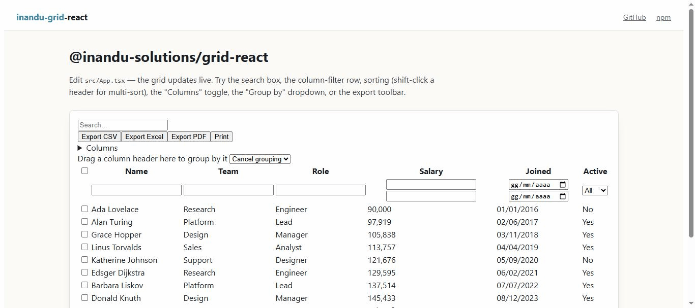
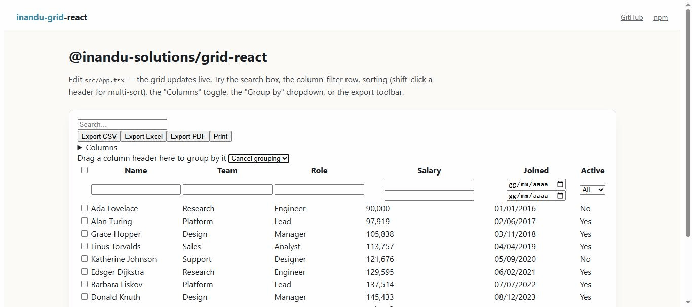

# inandu-grid-react

**A lightweight React data grid with the essentials other grids gate behind a paid enterprise
licence — row grouping, aggregates, inline editing and Excel-compatible export — fully MIT.** The
React port of [`@inandu-solutions/grid-angular`](https://github.com/inandusolutions/inandu-grid),
kept in sync feature-for-feature by hand.

[](https://www.npmjs.com/package/@inandu-solutions/grid-react)
[](https://www.npmjs.com/package/@inandu-solutions/grid-react)
[](https://github.com/inandusolutions/inandu-grid-react/actions/workflows/ci.yml)
[](https://bundlephobia.com/package/@inandu-solutions/grid-react)
[](LICENSE)

[](https://inandusolutions.github.io/inandu-grid-react/)
[](https://stackblitz.com/github/inandusolutions/inandu-grid-react/tree/main/examples/stackblitz)

[](https://inandusolutions.github.io/inandu-grid-react/)

<sub>Live free-text search on the demo grid. [Try every feature →](https://inandusolutions.github.io/inandu-grid-react/)</sub>

## Try it in 30 seconds

```bash
npm install @inandu-solutions/grid-react
```

```tsx
import { InanduGrid } from '@inandu-solutions/grid-react';
import '@inandu-solutions/grid-react/style.css';

const rows = [{ name: 'Ada', age: 36 }, { name: 'Alan', age: 41 }];
const columns = [{ field: 'name', headerText: 'Name' }, { field: 'age', headerText: 'Age', type: 'number' as const }];

export default function App() {
  return <InanduGrid rows={rows} columns={columns} pageSize={25} />; // sorting + filtering are on by default
}
```

- **▶️ [Live demo](https://inandusolutions.github.io/inandu-grid-react/)** — try every feature in the browser.
- **⚡ [Edit in StackBlitz](https://stackblitz.com/github/inandusolutions/inandu-grid-react/tree/main/examples/stackblitz)** —
  installs `@inandu-solutions/grid-react` from npm; edit `src/App.tsx` and it updates live ([source](examples/stackblitz)).
- **📦 [`@inandu-solutions/grid-react` on npm](https://www.npmjs.com/package/@inandu-solutions/grid-react)**
  (MIT) — `0.x` while the API settles; expect breaking changes between minors until `1.0.0`.

## Who is this for?

- **CRUD / business apps** that need sortable, filterable, editable tables without pulling in a
  full enterprise grid framework.
- **Admin dashboards** that need grouping, aggregates and CSV/Excel/PDF export out of the box.
- **Data-heavy React apps** that need virtual scroll and server-side paging for large datasets,
  without the bundle size of a kitchen-sink grid.

**When not to use it:** if you need pivot tables or integrated charting built into the grid itself,
this isn't that — see [Not included](#not-included) below.

## Angular version

[`inandu-grid`](https://github.com/inandusolutions/inandu-grid) is the original, feature-complete,
MIT-licensed Angular grid this repo is ported from — same feature set, same core logic, adapted for
Angular signals/standalone components instead of React hooks.

## Not included

Deliberately *not* a kitchen sink: no pivoting and no integrated charts — those stay out of scope
so the core stays small and auditable. Everything else on this page (grouping, aggregates, editing,
export, virtual scroll, server-side mode) is included, free, no enterprise tier. If you need pivot
tables or built-in charts, a heavier framework is the right tool; if you want a focused, free,
lightweight grid, this is it.

## Commercial add-ons

`@inandu-solutions/grid-pro-react` *(private, paid, not released yet)* — the React port of
`@inandu-solutions/grid-pro`, depends on this package the same way grid-pro depends on grid-angular.

## See it

Grouping and live free-text search — running in the [demo](https://inandusolutions.github.io/inandu-grid-react/),
which also has tabs for inline editing and tree data.

[](https://inandusolutions.github.io/inandu-grid-react/)

## Features

**Feature-complete with grid-angular.** The framework-agnostic core (sorting, filtering,
aggregation, export, i18n) is ported from grid-angular's
[`core/`](https://github.com/inandusolutions/inandu-grid/tree/main/projects/inandu-grid/src/lib/core)
folder and kept in sync by hand across the two repos. The React-specific layer — the
[`<InanduGrid>`](#api-shape) component and the [`useInanduGrid()`](#api-shape) headless hook —
covers:

- Sorting — single-column, or multi-column via shift-click
- Free-text search and per-column filtering, plus an `extraRowFilter` escape hatch for your own predicates
- Pagination, single-column grouping with aggregates, row selection
- CSV / Excel (`.xls`) / PDF export, and print
- i18n — 5 built-in languages via a `lang` prop
- Inline row editing, creation and deletion, with validation (required / min / max / pattern / custom / async)
- Excel-style Ctrl+C / Ctrl+V clipboard copy/paste
- Runtime column show/hide, sticky (pinned left/right) columns, drag-reorder
- Column resize (drag a header's handle) and autosize (double-click it to fit content)
- Row drag-reorder
- Tree data (`treeChildrenKey`) — display and expand only, no inline editing/drag/clipboard on tree
  rows, same restriction as grid-angular
- Master-detail (`renderDetail`)
- Custom cell / header / edit-control rendering per column (`renderCell` / `renderHeader` /
  `renderEditor`) — drop in your own component in place of the built-in formatted text, header
  label, or edit-mode input, without losing sorting, resizing, or validation
- Excel-style cell range selection (`cellRangeSelection`, `multiRange`) — click-and-drag or
  shift-click across cells to select a rectangular block; `Ctrl+C` copies the whole range as TSV
  when `clipboard` is also on
- Row virtualization (`virtualScroll`) for large datasets

Two things work slightly differently from grid-angular because they need a real browser layout
engine that a unit-test environment can't provide: virtual scroll's row height isn't
auto-measured — pass `virtualRowHeight` explicitly — and autosize's content measurement itself is
trusted (ported verbatim, same DOM APIs) rather than end-to-end tested; see
[`measureColumn.ts`](src/utils/measureColumn.ts)'s doc comment for exactly what its test suite does
and doesn't cover.

## API shape

```tsx
import { InanduGrid, useInanduGrid } from '@inandu-solutions/grid-react';
import '@inandu-solutions/grid-react/style.css'; // optional default styling — skip it and bring your own

// Component: batteries-included table.
<InanduGrid rows={rows} columns={columns} />;

// Hook: headless — bring your own markup.
const { visibleRows, filteredRowCount, sortCriteria, setSort, filterValues, setFilterValue, page, setPage, pageCount } =
  useInanduGrid({ rows, columns, pageSize: 25 });
```

## Development

```bash
npm install
npm run dev        # Vite dev server
npm test           # Vitest + React Testing Library
npm run build      # library build (dist/)
```

## Contributing

Issues and PRs welcome. Please read [`CONTRIBUTING.md`](CONTRIBUTING.md) first, and note the
[Code of Conduct](.github/CODE_OF_CONDUCT.md). Security reports: [`.github/SECURITY.md`](.github/SECURITY.md).

## License

MIT © [Inandu SAS](https://inandu.com)
